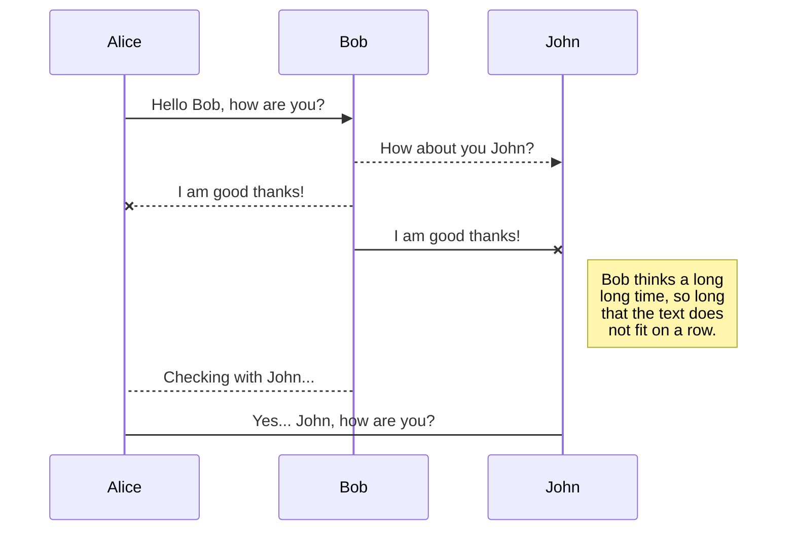

## 1. Git?

자신의 소스코드를 효율적으로 관리할 수 있고, 여러 개발자들이 동시에 개발하는 것이 수월해 진다.

작업흐름을 간단히 표현하면
*Directory -> Stage -> Local Store -> Remote Store*로 나타낼 수 있다.
원격 저장소의 경우는  [github](https://github.com) 와 같은 사이트를 이용할 수 있다.

---

## 2. init

현재 디렉토리를 git 저장소로 만들고 .git 이라는 파일이 생성된다.

    $ git init

 
작업흐름 상태  

*<U>Directory</U> -> Stage -> Local Store -> Remote Store*

---

## 3. add

현재 git 저장소에서 변경된 파일이 있으면 추적하고 해당 파일들을 스테이지로 올린다.

    $ git add "파일명"

모든 파일을 add 하고 싶으면 파일명에 .을 쓰면 된다.

    $ git add .

 
작업흐름 상태  

*Directory -> <U>Stage</U> -> Local Store -> Remote Store*

---

## 4. commit

현재 git의 스테이지에 있는 파일들을 로컬 저장소로 올린다. 또한 어떤 파일, 기능들을 수정했는지 알아보기 위한 메세지를 남길 수 있다.

    $ git commit -m "msg"

 
작업흐름 상태  

*Directory -> Stage -> <U>Local Store</U> -> Remote Store*

---

## 5. push

현재 로컬 저장소의 파일들을 원격 저장소에 올린다.  

해당 명령어로 master 브랜치의 원격 저장소로 올린다.

    $ git push origin master

 
작업흐름 상태  

*Directory -> Stage -> Local Store -> <U>Remote Store</U>*

---

## 6. status

현재 디렉토리의 변경된 상태들을 보여준다.

    $ git status



---

## 7. clone

다른 원격 저장소를 가져와서 git 저장소를 만든다.

해당 명령어를 사용하게되면 해당 디렉토리가 저장소가 되는 것이 아니라 디렉토리가 새로 생성된 뒤 그 디렉토리가 저장소가 된다.

    $ git clone 원격저장소

마지막에 .을 붙이게 되면 해당 디렉토리가 저장소가 된다.

    $ git clone 원격저장소 .

---

## 8. pull

만약 두 명의 개발자가 프로젝트를 진행하고 있다면 한명의 개발자가 해당 프로젝트에 대해 수정을 하고 원격 저장소에 push를 하게 된다면 다른 개발자는 변경된 프로젝트 내용이 자신의 디렉토리에는 반영이 되어 있지 않다. 그 반영된 것을 원격 저장소로부터 가져올 수 있는 명령어 이다.

    $ git pull 원격저장소

---

